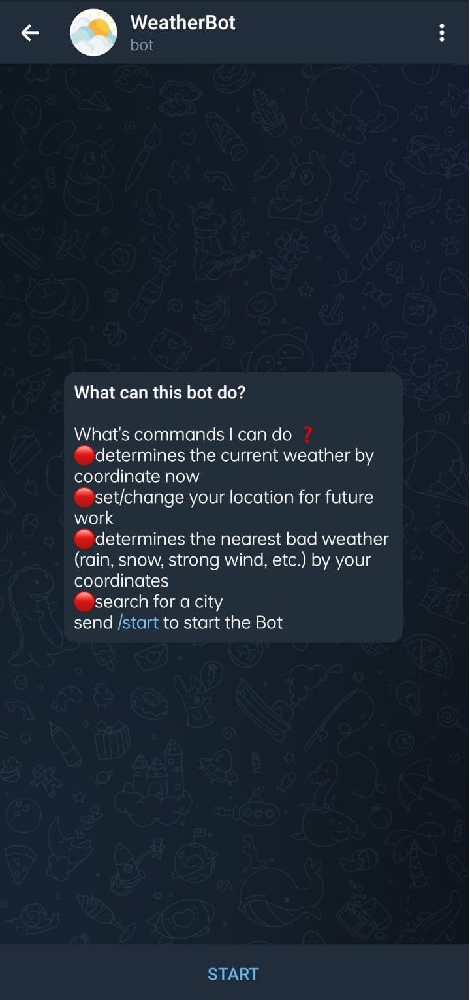
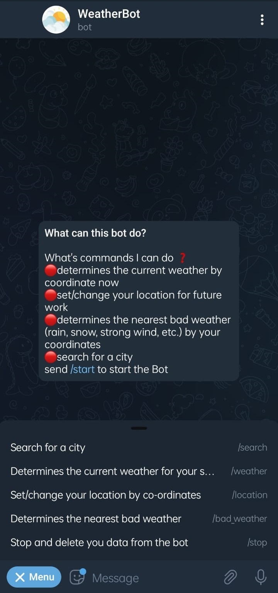
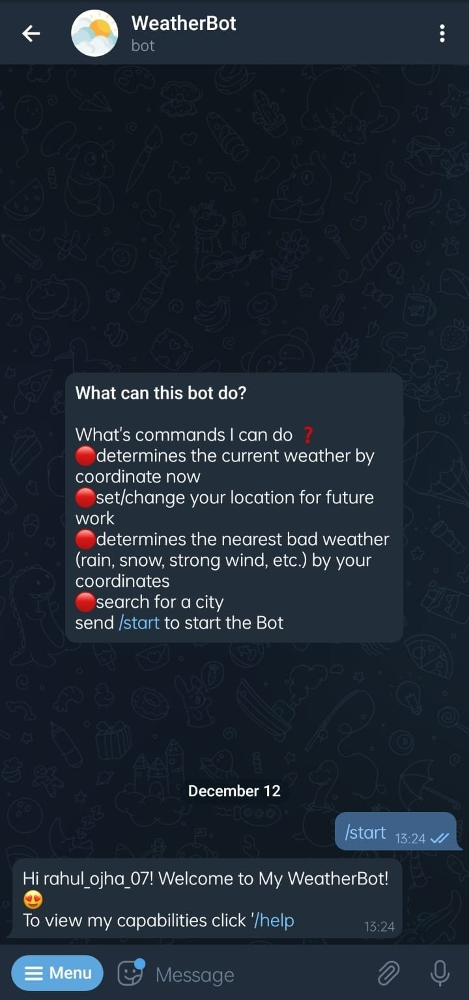
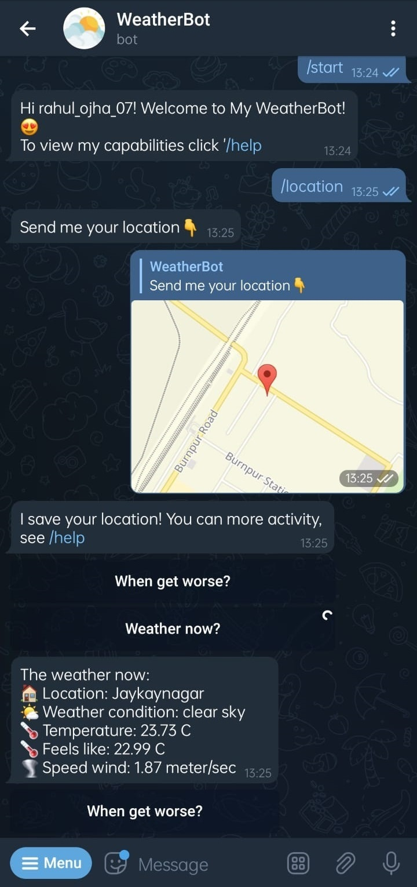
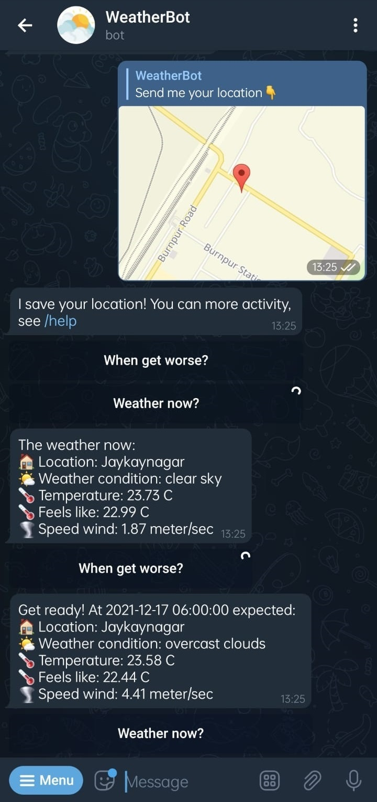
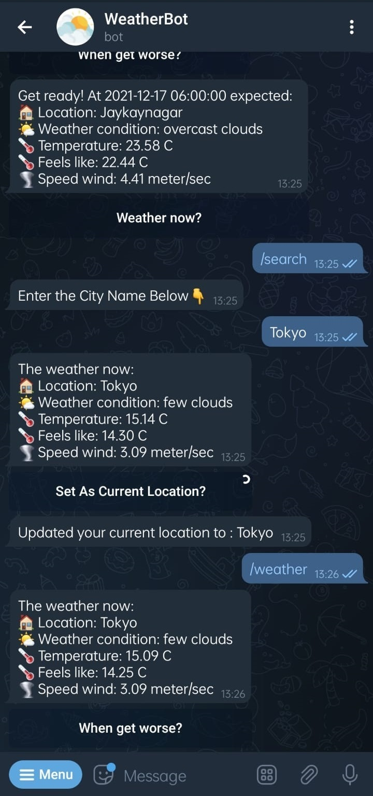

# Weather Bot Telegram

[](https://github.com/tterb/atomic-design-ui/blob/master/LICENSEs)
[](https://mvnrepository.com/artifact/org.telegram/telegrambots/5.4.0.1)
[](https://mvnrepository.com/artifact/org.telegram/telegrambotsextensions/5.4.0.1)


The bot can be used to get the weather at your current location, It can help you search for the weather at some other location as well.


## Available Commands

| Command | Description                |
| :-------- | :------------------------- |
| `/start` | Command to start the Bot |
| `/help` | Get the list of all available commands |
| `/location` | Set your current location |
| `/weather` | Get the weather at your set location |
| `/bad_weather` | Find the nearest bad weather at your set location |
| `/stop` | Stop the bot and delete all your data |

## Run Locally

Clone the project

```bash
  git clone https://github.com/rahul-ojha-07/weather-bot-telegram.git
```

Go to the project directory

```bash
  cd weather-bot-telegram
```
Provide Api Tokens

```bash
  add required tokens to src/main/resources/config.properties or,
  Provide the tokens via Environment Variables/Properties. (IDE/Heroku)
```

Install dependencies/ Build Project

```bash
  mvn clean install
```

Start the Bot

```bash
  java -jar target/weatherBot-single.jar
```


## Environment Variables

To run this project, you will need to add the following environment variables to your `src/main/resources/config.properties` file or provide them at the `Runtime using Environment Variables`

| Variable             | Description                                                                |
| ----------------- | ------------------------------------------------------------------ |
|API_KEY|API Key/Token of OpenWeatherMap|
|BOT_NAME|Name of the bot|
|BOT_TOKEN|Api token for the bot generated from botfather|
|OWNER_NAME|Owner Name of the Bot (optional)|
|DATABASE_USER|DB username|
|DATABASE_PASS|DB password|
|JDBC_DATABASE_URL|JDBC URL of the DATABASE|

`Note: you can use almost any DataBase(h2,postgres,mysql,etc) in some cases you may need to change the SQL Queries in DBUser.java to match your DataBase`


## Screenshots

<p align="center">
  
  
  
  <br>
  
  
  
</p>


## Tech Stack

**Development:** [Java](https://www.java.com/en/), [Maven](https://maven.apache.org/), [OpenWeather API](https://openweathermap.org/api), [Telegram Bot Java Library](https://mvnrepository.com/artifact/org.telegram/telegrambots/5.4.0.1), [Emoji Java](https://github.com/vdurmont/emoji-java) ,[PostgreSQL](https://www.postgresql.org/)

**Hosting/Deployment:** [Heroku](https://dashboard.heroku.com/apps)

